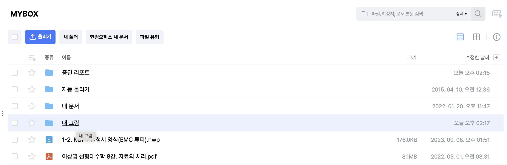
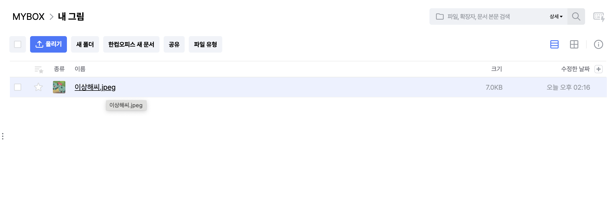

# 구현과제 5. SPB(Single Page Box)

> 이 과제는 [네이버 MYBOX](https://mybox.naver.com)를 모티브로 제작되었습니다.

## 유의사항

**읽기 좋은 코드**에 집중해주세요.

- 기능의 정상 동작 여부
- 작성하는 코드의 퀄리티
- Git 관리 수준
- PR, 코드 리뷰 방식

최소 기능 구현만 만족하면 **자유롭게 커스텀**이 가능합니다.

- 디자인 커스텀 가능
- 폴더 구조 커스텀 가능
- 코드 컨벤션 커스텀 가능
- 의존성 설치 및 삭제 가능

**README 작성**은 필수입니다.

- 자신의 코드에서 강조할 부분
- 자신의 코드에서 부족한 부분
- 기타 코드를 이해하는데 도움을 주는 내용

Fork & PR 등 과제 진행과 관련된 내용은,  
 [우테코 따라잡기 2 노션 - 구현과제 진행 관련 유의사항](https://yopark.notion.site/2386b22b37b643c5ac67a6db8350e027) 문서를 참고해주세요.

배포 이후 **배포 주소**를 말씀해주시면 해당 주소를 CORS에 추가하도록 하겠습니다.

## API

API 주소 : https://not-woowacourse-api.yopark.dev

자세한 내용은 [Swagger](https://not-woowacourse-api.yopark.dev/api-docs)를 참고해주세요.

이번 과제에서 사용할 API는 **0.x(공통), 5.x(SPB)** 입니다.

> 이걸 만든 사람은 백엔드 개발자가 아닙니다. 사용해보시고 오류나 빈틈이 있으면 채널톡 부탁드립니다 😭

## 구현해야 할 기능

> SPB 시연 링크 :  
> SPB 시연 레포 :

나만의 클라우드 스토리지를 제작해봅시다 📤

> ❗️ 구현 난이도를 낮추기 위해 파일 업로드 및 삭제, 디렉토리 생성 및 삭제는 뷰로 만들지 않고 Swagger를 통해 수행합니다.  
> 자세한 사항은 [우테코 따라잡기 2 노션 - 5.x API () 상세 사용 방법]()을 참고해주세요.

**디렉토리 리스팅(Directory Listing)** 뷰를 구현해야 합니다.

- 특정 디렉토리 내에 있는 파일 및 디렉토리 목록을 볼 수 있어야 합니다.
  - 디렉토리 클릭 시 해당 디렉토리에 대한 목록을 볼 수 있어야 합니다.
  - 하위 디렉토리 이동 후 다시 상위 디렉토리로 이동할 수 있어야 합니다.
- 이미지 파일 클릭 시 모달로 이미지를 볼 수 있어야 합니다.
  - `ESC` 키를 입력하여 이미지 뷰어 모달을 끌 수 있어야 합니다.

## 참고 스크린샷 (네이버 MYBOX)

> 단순 참고용입니다. 똑같은 뷰로 만들지 않으셔도 무방합니다 😁

[사진 1] 루트 디렉토리

- 파일 및 디렉토리 목록을 볼 수 있습니다.
- 디렉토리를 클릭하여 해당 디렉토리로 이동할 수 있습니다.

[사진 2] **내 그림** 디렉토리

- `MYBOX` [브레드크럼](https://uiux.egovframe.go.kr/guide/component/component_03_03.html) 아이템을 클릭하여 상위 디렉토리로 이동할 수 있습니다.
  - `..` 라는 이름의 폴더를 별도로 두어, 클릭 시 상위 디렉토리로 이동하도록 하는 방법도 있습니다.

[사진 3] **이상해씨.jpeg** 이미지 뷰어 모달

- 이미지 파일을 클릭했을 때의 뷰입니다.
- 뒤로가기 버튼을 클릭하거나 `ESC` 키를 입력하여 이미지 뷰어 모달을 종료할 수 있습니다.
  

## 기술 스택 관련 제한사항

- SPA 프레임워크 의존성은 설치할 수 없습니다. (e.g., React, Vue.js, Angular, Next.js, Svelte, Solid)
- HTML 템플릿 엔진 의존성은 필요에 따라 설치하셔도 무방합니다. (e.g., Handlebar.js, ejs, Pug)
